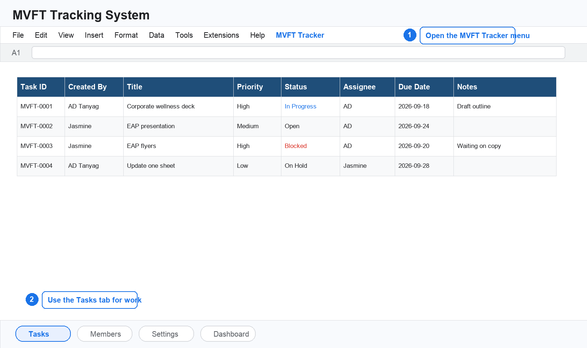
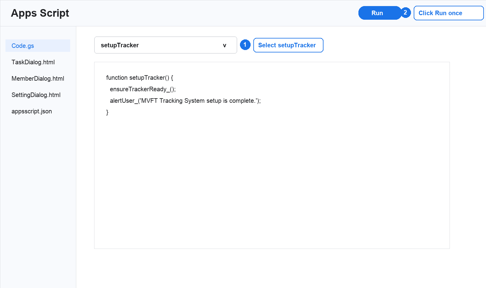
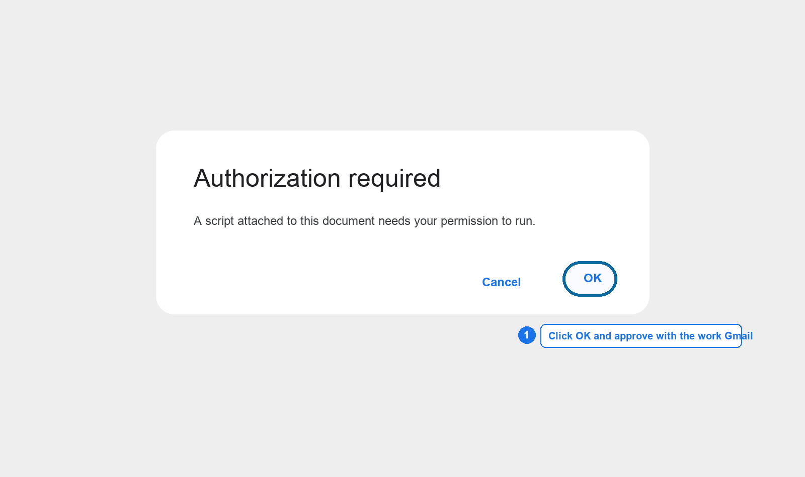
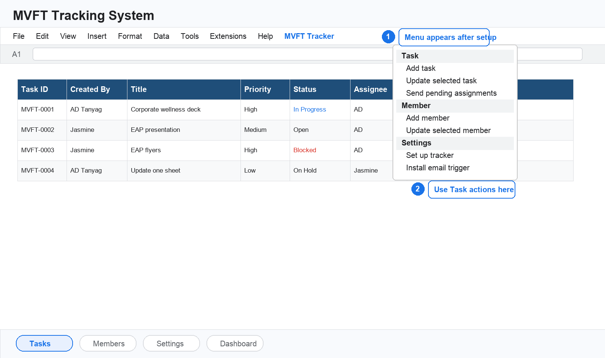
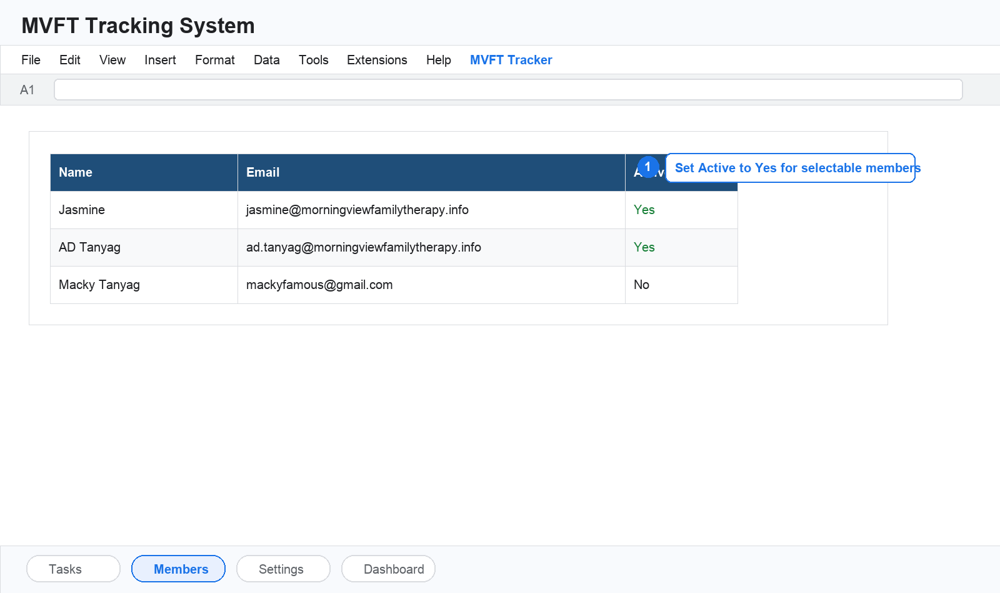
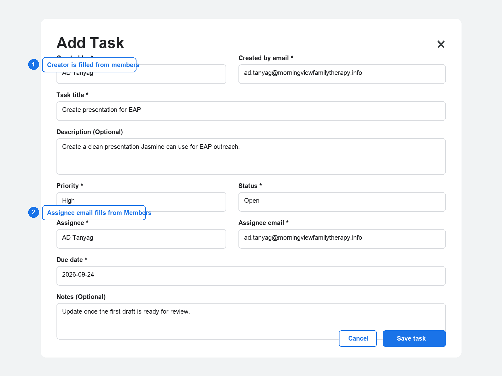
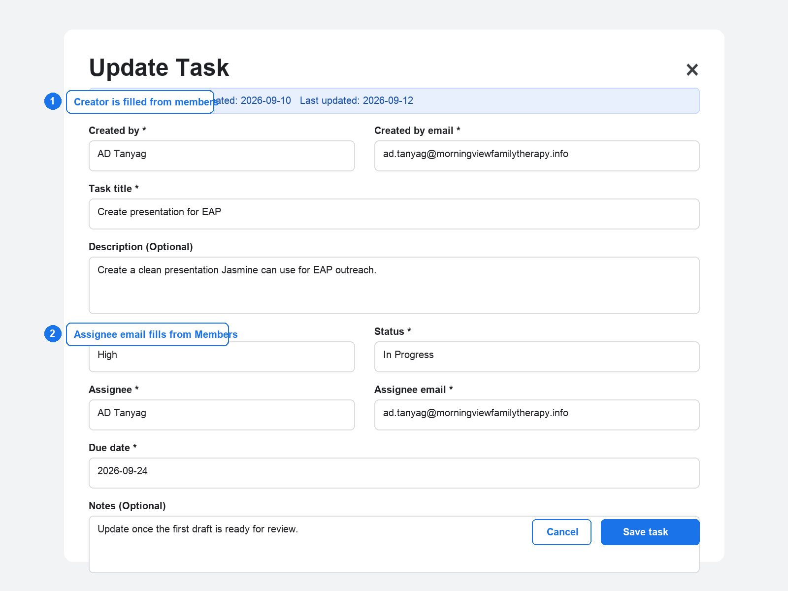
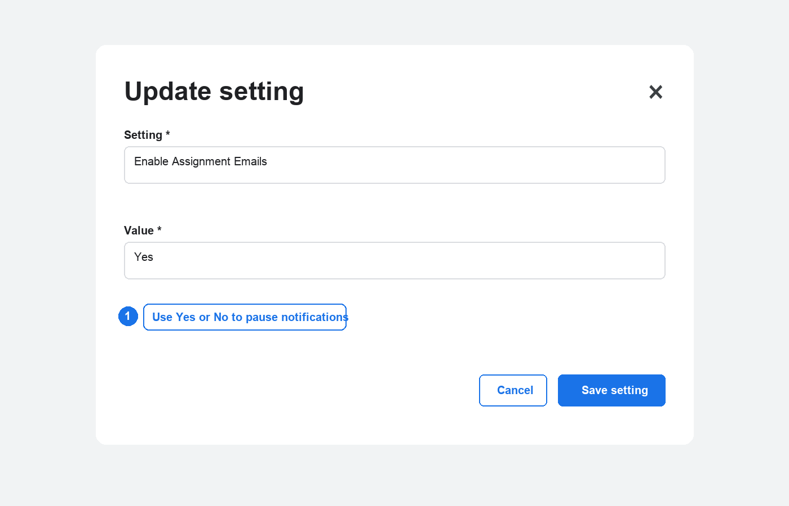
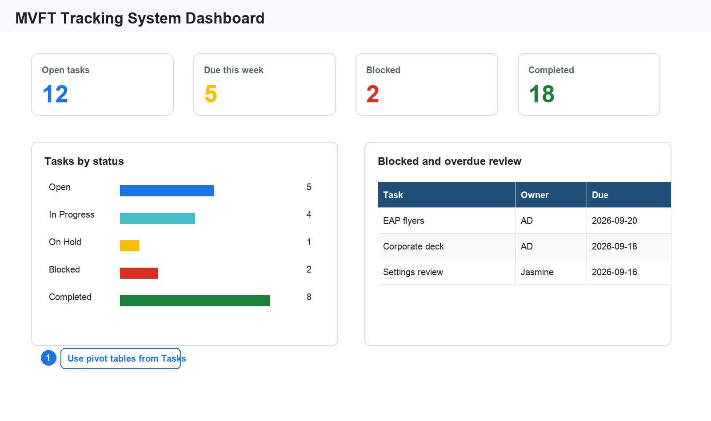

# MVFT Tracking System User Manual

For staff and admin

Last updated: September 2026

## Purpose

The MVFT Tracking System is a Google Sheets task tracker for Morning View Family Therapy work requests. This manual shows staff and admin how to set up the tracker, add members, create and update tasks, understand email notifications, and review work through a dashboard.

Use the work Gmail account, `ad.tanyag@morningviewfamilytherapy.info`, as the owner and sender account. The recommended Apps Script timezone for Jasmine's Rancho, California team is `America/Los_Angeles`.

## System overview

The tracker runs inside Google Sheets. The main work happens in the `Tasks` tab, with members and configuration stored in their own tabs.

| Area | Purpose |
| --- | --- |
| Tasks | Main task list for titles, owners, priority, status, assignee, due dates, notes, and notification history. |
| Members | Directory of people who can be selected as task creators or assignees. |
| Settings | Tracker defaults and email notification toggles. |
| Dashboard | Optional pivot-table reporting area built from the Tasks tab. |

## One time setup

Complete these steps after duplicating the Google Sheet into the work Gmail account.

1. Open the duplicated Google Sheet.
2. Go to `Extensions > Apps Script`.
3. Confirm these files exist: `Code.gs`, `TaskDialog.html`, `MemberDialog.html`, `SettingDialog.html`, and `appsscript.json`.
4. Confirm `appsscript.json` uses `"timeZone": "America/Los_Angeles"`.
5. Select the `setupTracker` function.
6. Click `Run`.
7. Approve the authorization prompts using `ad.tanyag@morningviewfamilytherapy.info`.
8. Select and run `installTriggers`.
9. Return to the sheet and refresh the browser tab.
10. Confirm the `MVFT Tracker` menu appears.

When Google asks for authorization, approve it with the work Gmail account. This matters because automated emails are sent by the account that authorizes the script.

## MVFT Tracker menu

After setup, use the `MVFT Tracker` menu for the normal workflow. This menu keeps users from editing the wrong columns by mistake.

| Menu area | Action | Use it for |
| --- | --- | --- |
| Task | Add task | Create a new task from one form. |
| Task | Update selected task | Edit the task row currently selected in the sheet. |
| Task | Send pending assignments | Send assignment emails for ready tasks that have not notified their current assignee. |
| Member | Add member | Add a staff or admin user to the Members tab. |
| Member | Update selected member | Edit the selected member row. |
| Settings | Set up tracker | Refresh tabs, headers, validation, formatting, and internal tracking. |
| Settings | Update setting | Change a tracker default or email toggle. |
| Settings | Install email trigger | Install the edit trigger used for direct sheet entry notifications. |

## Members

Add Jasmine and AD before creating tasks. Members are used by the task form to populate creator and assignee names and email addresses.

| Field | What to enter |
| --- | --- |
| Name | Display name, such as `Jasmine` or `AD Tanyag`. |
| Email | Email address used for notifications. |
| Active | `Yes` if the member should appear in selections. Use `No` to keep a record but remove it from normal use. |

## Create a task from the menu

Use `MVFT Tracker > Task > Add task` for regular task creation.

1. Confirm `Created by` and `Created by email`.
2. Enter a clear task title.
3. Add a description if helpful.
4. Select `Priority`.
5. Select `Status`.
6. Select or type the assignee name.
7. Confirm the assignee email fills automatically from `Members`.
8. Enter the due date as `yyyy-MM-dd`.
9. Add notes if needed.
10. Click `Save task`.

Example task titles:

- Create presentation for corporate wellness
- Create presentation for EAP
- Create flyers for EAP

## Update a task

Use `MVFT Tracker > Task > Update selected task` when changing an existing task.

1. Go to the `Tasks` tab.
2. Click any cell in the task row.
3. Open `MVFT Tracker > Task > Update selected task`.
4. Change the needed fields.
5. Click `Save task`.

The person in `Created By Email` receives an update email when meaningful task fields change, such as status, priority, assignee, due date, description, or notes.

## Create a task directly in the sheet

Direct sheet entry is supported, but the row must be complete before notifications send.

For a new manual task row, fill these fields:

- Created By
- Created By Email
- Title
- Priority
- Status
- Assignee
- Assignee Email
- Due Date

Description and Notes are optional. The columns after `Notes` are script metadata and are hidden by setup.

The script waits until the required task fields are filled before sending emails. This prevents update emails from being sent repeatedly while someone is still typing a new manual task row.

## Task fields

| Field | Description |
| --- | --- |
| Task ID | Auto-generated ID such as `MVFT-0001`. |
| Created At | Date and time the task was first created. |
| Updated At | Date and time the task was last changed by the script. |
| Created By | Person who requested or created the task. |
| Created By Email | Email address that receives update notifications. |
| Title | Short name of the task. |
| Description | Optional detail about what needs to be done. |
| Priority | `Low`, `Medium`, `High`, or `Urgent`. |
| Status | Current progress state. |
| Assignee | Person responsible for doing the task. |
| Assignee Email | Email address that receives assignment notifications. |
| Due Date | Target completion date. Use `yyyy-MM-dd`. |
| Notes | Optional working notes, updates, or completion details. |
| Assignment Notification Status | Hidden script record showing whether assignment notification was sent or skipped. |
| Assignment Notified Email | Hidden script record of the last assignee email that received an assignment notification. |
| Assignment Notified At | Hidden script record of the date and time the assignment notification was sent. |
| Update Notification Status | Hidden script record showing whether creator update notification was sent or skipped. |
| Update Notified At | Hidden script record of the date and time the creator update notification was sent. |

## Status guide

| Status | Use when |
| --- | --- |
| Open | The task exists but work has not started yet. |
| In Progress | Someone is actively working on the task. |
| On Hold | The task is paused and can continue later. |
| Blocked | Work cannot continue because something is missing or another decision is needed. |
| Completed | The task is done. |
| Cancelled | The task is no longer needed. |

Use `On Hold` when the task is paused by choice or timing. Use `Blocked` when progress is stuck because of a dependency, missing information, access issue, or decision.

## Email notifications

Assignment notifications go to the assignee when a task is newly assigned and ready.

Creator update notifications go to the `Created By Email` address when an existing task changes.

The tracker avoids duplicate assignment emails by storing the last assignee email that was notified. If the assignee email changes, the new assignee can receive a new assignment email.

## Settings

Use `MVFT Tracker > Settings > Update setting` to update default values or pause notifications.

| Setting | Typical value | Purpose |
| --- | --- | --- |
| Tracker Name | `MVFT Tracking System` | Name used in alerts and emails. |
| Notification Prefix | `[MVFT]` | Prefix used in email subject lines. |
| Default Priority | `Medium` | Priority used when a direct sheet entry leaves priority blank. |
| Default Status | `Open` | Status used when a direct sheet entry leaves status blank. |
| Enable Assignment Emails | `Yes` | Sends emails to assignees. |
| Enable Creator Update Emails | `Yes` | Sends emails to task creators when existing tasks change. |

## Dashboard

The dashboard can be built with pivot tables from the `Tasks` tab. A good first dashboard for Jasmine is a status summary, work by assignee, due-this-week list, and blocked task review.

Recommended dashboard sections:

| Section | Suggested view |
| --- | --- |
| Open work by status | Count of Task ID grouped by Status. |
| Work by assignee | Count of Task ID grouped by Assignee and Status. |
| Priority view | Count of Task ID grouped by Priority and Status. |
| Due date review | Tasks grouped by Due Date, Status, and Assignee. |
| Completed work | Count of completed tasks by month. |
| Blocked work | Filter Status to Blocked and show Title, Assignee, Notes, and Due Date. |

## Troubleshooting

| Issue | What to check |
| --- | --- |
| The MVFT Tracker menu does not appear | Refresh the Google Sheet. If it still does not appear, open Apps Script and run `setupTracker` once. |
| Authorization keeps appearing | Make sure the same work Gmail account owns and runs the script. Some authorization prompts are normal after copying a script or changing scopes. |
| Emails are not sending | Run `installTriggers` from the work Gmail account. Also check Settings to confirm email toggles are set to `Yes`. |
| Assignee email does not fill | Confirm the assignee exists in Members with `Active` set to `Yes` and a valid email address. |
| A manual task row does not send email | Confirm all required task fields are filled, especially Created By Email, Assignee Email, Priority, Status, and Due Date. |
| Date entry behaves strangely | Enter dates as `yyyy-MM-dd`, such as `2026-09-11`. Confirm the script timezone is `America/Los_Angeles`. |
| Dropdown validation error appears | Run `Set up tracker` from the Settings menu to refresh validation rules. |

## Quick reference

- Work Gmail should own and authorize the tracker.
- Use `MVFT Tracker > Task > Add task` for normal task creation.
- Use `MVFT Tracker > Task > Update selected task` for edits.
- Keep `Members` updated before assigning tasks.
- Use `yyyy-MM-dd` for due dates.
- Leave hidden notification metadata columns alone unless troubleshooting.
- Use `On Hold` for paused work and `Blocked` for work that cannot move forward.
